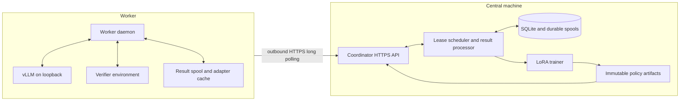

# Aether RL

Aether RL is a single-run distributed reinforcement-learning system. A central coordinator trains one LoRA policy while up to 100 trusted workers execute complete verifier v1 rollouts against local vLLM servers.

## Responsibilities

The coordinator:

- Loads tasksets and creates policy-pinned rollout groups.
- Registers workers and manages leases, attempts, cancellation, and policy lag.
- Durably accepts exact rollout traces before acknowledging them.
- Calculates advantages, applies filters, and emits atomic trainer batches.
- Starts the central trainer and publishes each completed LoRA adapter immutably.
- Stores run state in SQLite WAL mode and durable filesystem spools.

Each worker:

- Loads the exact pinned base model and tokenizer revision.
- Starts vLLM on loopback and loads adapters under immutable serving names.
- Long-polls the coordinator only when it has an execution slot.
- Executes the complete environment episode locally.
- Persists completed results until the coordinator acknowledges them.
- Verifies policy manifests, file sizes, and SHA-256 digests before serving.

## Policy lifecycle

Policy version 0 is the pinned base model without an adapter. Each trainer step writes a full resumable checkpoint and a safetensors adapter. After both artifacts are stable, the coordinator publishes a content-addressed policy manifest and activates it transactionally. New groups use the active policy; existing groups remain pinned to their original policy.

The full model never crosses the coordinator-worker network. Every machine downloads the same base model independently, and only LoRA artifacts are transferred after startup.

## Trust and security

Workers are trusted operator-controlled machines. Aether RL authenticates `/api/v1/*` with one shared ASCII bearer token and protocol version header. It does not provide per-worker credentials, authorization scopes, rate limiting, mTLS, or protection against poisoned results.

The coordinator serves HTTP. Terminate TLS in an external reverse proxy, load balancer, service mesh, or VPN gateway. Remote worker URLs must use HTTPS; plain HTTP is accepted only for loopback hosts. `/health`, `/ready`, and generated FastAPI schema pages are not authenticated.

Workers require no inbound connectivity. Their vLLM server binds to loopback and has no API key in the supervised configuration.

## Durability boundaries

The coordinator database references files under the complete `run_root`; the worker identity, adapter cache, and pending results live under `state_dir`. These directories are part of the system state and must reside on persistent local storage. Neither directory is a shared filesystem protocol.

SQLite is intended for one coordinator and approximately 100 workers. A run root has a process lock and must never be opened by two coordinators.
