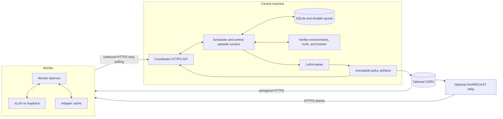

# Aether RL

Aether RL is a single-run distributed reinforcement-learning system. A central coordinator owns verifier v1 rollout execution and trains one LoRA policy, while up to 100 trusted workers provide remote inference from local vLLM servers.

## Responsibilities

The coordinator:

- Loads tasksets and creates policy-pinned rollout groups.
- Runs every verifier environment, Docker sandbox, tool call, episode finalizer, and scoring hook.
- Relays each environment's inference requests through an assigned worker and its loopback vLLM server.
- Registers workers and manages leases, attempts, cancellation, and policy lag.
- Durably accepts exact rollout traces before acknowledging them.
- Calculates advantages, applies filters, and emits atomic trainer batches.
- Starts the central trainer and publishes each completed LoRA adapter immutably.
- Stores run state in SQLite WAL mode and durable filesystem spools.

Each worker:

- Loads the exact pinned base model and tokenizer revision.
- Starts vLLM on loopback and loads adapters under immutable serving names.
- Advertises inference slots, leases inference work, and exchanges requests and replies over outbound HTTPS.
- Verifies policy manifests, file sizes, and SHA-256 digests before serving.

Workers never load verifier environments, run Docker or tools, finalize episodes, or score results. The inference relay keeps worker connections outbound-only: the coordinator queues an OpenAI-compatible request, the worker receives it through `/api/v2/inference/exchange`, forwards it to loopback vLLM, and returns the response through the same authenticated exchange.

## Policy lifecycle

Policy version 0 is the pinned base model without an adapter. Each trainer step writes a full resumable checkpoint and a safetensors adapter. After both artifacts are stable, the coordinator publishes a content-addressed policy manifest and activates it transactionally. New groups use the active policy; existing groups remain pinned to their original policy.

The full model never crosses the coordinator-worker network. Every machine downloads the same base model independently, and only LoRA artifacts are transferred after startup. R2/S3 can hold verified immutable copies and a SHARDCAST relay can accelerate safetensors delivery; workers verify the final SHA-256 digest regardless of source and retain coordinator HTTP as the default fallback.

## Trust and security

Workers are trusted operator-controlled machines. Aether RL authenticates `/api/v2/*` with one shared ASCII bearer token and `Aether-Protocol-Version: 2`. It does not provide per-worker credentials, authorization scopes, rate limiting, or mTLS.

The coordinator serves HTTP. Terminate TLS in an external reverse proxy, load balancer, service mesh, or VPN gateway. Remote worker URLs must use HTTPS; plain HTTP is accepted only for loopback hosts. `/health`, `/ready`, and generated FastAPI schema pages are not authenticated.

Workers require no inbound connectivity. Their vLLM server binds to loopback and has no API key in the supervised configuration.

## Durability boundaries

The coordinator durably accepts completed episodes into SQLite and result artifacts under the complete `run_root` before processing them. The worker `state_dir` contains its stable identity, adapter cache, generated inference configuration, and logs, but is not a result-durability boundary. Both directories should use persistent local storage; neither is a shared filesystem protocol.

SQLite is intended for one coordinator and approximately 100 workers. A run root has a process lock and must never be opened by two coordinators.
